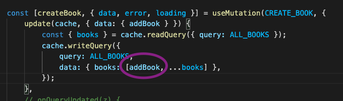

On refresh also, data remains stored.
Shows usage of useMutation, update cache readQuery, optimisticResponse, onQueryUpdated

```
npm run server
```
# Cache Order 
You can code to update your cache in any way possible. Top, middle, 2nd, 3rd, last, whatever.

-----
You can add the new book to the top. Like below




------


But in the graphiql console, it is added according to the database rules.
 

-------
But when you refresh the browser, it takes it original order like in the graphql database


-------
# Optimistic Response 
If you have terribly slow internet, it will show something instantly. 
> But updating the cache is required to make this work. Just using optimistic response on it's own wont work. CHeck the below two snippets.
```
createBook({
			variables: { title, author },
            optimisticResponse : {
                __typename: 'Mutation',
                addBook : {
                    id: 234,
                    title : 'optimistic responsee',
                    author : 'vscode',
                    __typename : 'Book'
                }
                
            }
		});
```
Remember -> With optimistic response also, you must run this function 
```
const [createBook, { data, error, loading }] = useMutation(CREATE_BOOK, {
		update(cache, { data: { addBook } }) {
			const { books } = cache.readQuery({ query: ALL_BOOKS });
			cache.writeQuery({
				query: ALL_BOOKS,
				data: { books: [addBook, ...books] },
			});
		},
```


You can set this to anything. You can set this to 
- `Title -> loading` 
- `Title -> aspdfalksdjfasdfasdf` 
- `Title -> input.title` (Preferred to make your app feel super fast)

# VERY IMPORTANT
Here I made a change in the schema but I forgot to update this optimistic response with the pagesRead property. HERE, it did not load because the properties were different. Because optimistic response did not have pagesRead property, it did not show it during the time real response was received from the server.


# Doubt

How is this working here?

## Some useful links
- [CRUD with graphql](https://codesource.io/build-a-crud-application-with-react-and-apollo-graphql/)
- [apollo client docs](https://www.apollographql.com/docs/react/api/react/hooks/#usemutation)
- [apollo mutations after what to do](https://www.apollographql.com/docs/react/data/mutations/#making-all-other-cache-updates)
- [apollo refetch ](https://www.apollographql.com/docs/react/data/mutations/#refetching-queries)


# CHeck for todo app
- [refetch apollo blog](https://www.apollographql.com/blog/apollo-client/caching/when-to-use-refetch-queries/)
- [codesandbox todo apollo](https://codesandbox.io/s/github/apollographql/docs-examples/tree/main/full-stack/todo-list/todo-list-client?fontsize=14&hidenavigation=1&theme=dark)


> uses window.location.reload() -> hardcoded refresh. No use.
- [TODO app code](https://codesource.io/build-a-crud-application-with-react-and-apollo-graphql/)
